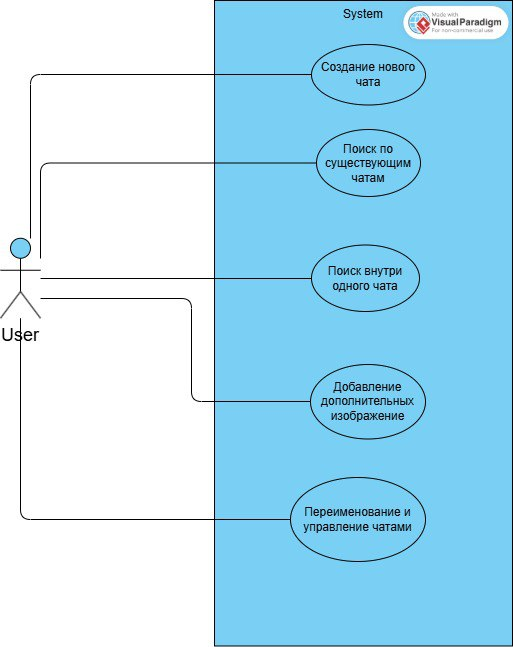

1.Happy Path (Основной успешный сценарий)

  1)Пользователь открывает приложение.
  
  2)Пользователь создает новый чат 
  
  3)Загружает рентгеновский снимок
  
  4)Вводит текстовый запрос
  
  5)Нажимает отправить
  
  6)Получает структурированное описание снимка от модели

  
User Value 

  1)Быстро выполняет основную задачу.
  
  2)Минимум шагов → экономия времени.
  
  3)Уменьшение количества ошибок.
  
  4)Понятный линейный процесс повышает удобство работы.
  

2.Alternative Flows (альтернативные сценарии)

2.1Сценарий А1: Нет интернета / сервер временно недоступен

  1)Пользователь открывает приложение.
  
  2)Система не может связаться с сервером.
  
  3)Пользователь получает сообщение: "Нет соединения. Повторить?"
  
  4)Пользователь может: повторить попытку, выйти из приложения.
  
User Value

  1)Пользователь не теряет данные.
  
  2)Понимает причину сбоя.
  
  3)Может продолжить работу позже без фрустрации.

  
2.2Сценарий А2: Загрузка некорректного файла.

  1)Пользователь загружает некорректный файл
  
  2)Система проводит валидацию и обнаруживает ошибку
  
  3)Показывается сообщение: "Неверный формат файла. Исправьте данные."
  
  4)Пользователь может повторить ввод без перезагрузки страницы.

  
User Value

  1)Экономит время на поиске ошибки.
  
  2)Получает подсказку, которая направляет его к исправлению.
  
  3)Нет потери введённых данных.

3.Error Handling (обработка ошибок)

Ошибка Е1: Технический сбой / Internal Server Error

  1)Пользователь отправляет запрос.
  
  2)Сервер не может выполнить операцию.
  
  3)Система отображает сообщение: "Произошла техническая ошибка. Повторите позже."
  
  4)Пользователь может повторить операцию без потери сессии.
  

User Value

  1)Прозрачность проблемы → доверие к системе.
  
  2)Возможность повторить действие позже без полной перезагрузки.
  
  3)Минимизация ущерба от сбоя.

Ошибка Е2: Некорректный ввод (валидация)

  1)Пользователь загружает файл.
  
  2)Валидация обнаруживает: неправильный формат файла.
  
  3)Система подсвечивает ошибку и показывает пояснение.
  
  3)Пользователь исправляет и повторяет ввод.

User Value
  1)Снижение количества ошибок.
  
  2)Повышение качества вводимых данных.
  
  3)Экономия времени на исправлении.
  

Ошибка Е3: Превышение размера загружаемого файла

  1)Пользователь загружает файл более 15МБ.
  
  2)Система блокирует операцию.
  
  3)Показывается сообщение: "Прикрепляемый файл не может быть более 15МБ. Попробуйте уменьшить размер изображения."
  
  4)Система предлагает варианты решения (сжать файл).

User Value

  1)Понятное объяснение причины отказа.
  
  2)Предотвращение потерь данных или перегрузки.
  
  3)Помощь в корректном выполнении задачи.

